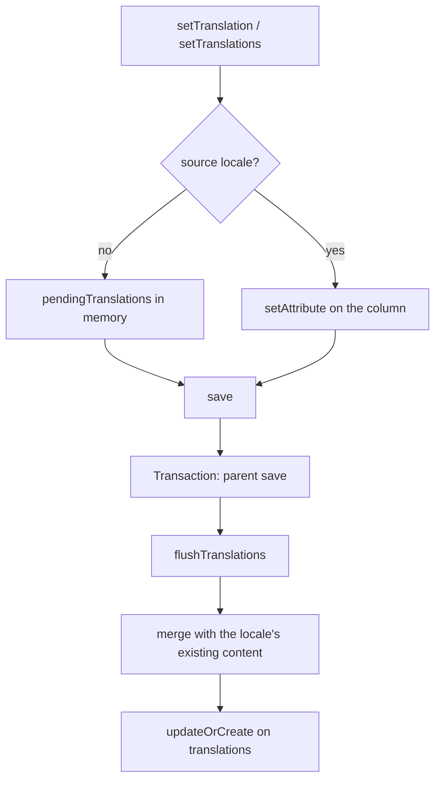
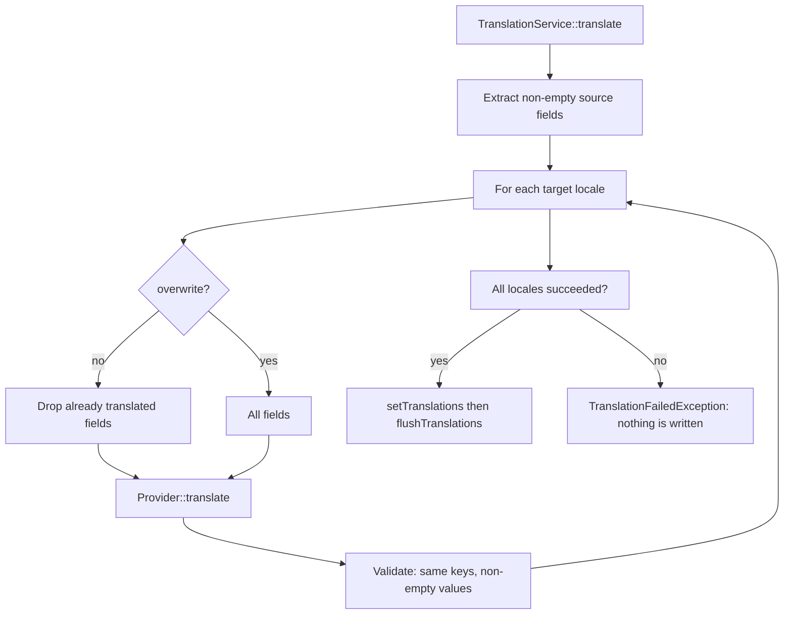

# Architecture

## Overview

The core of the package is framework-agnostic. A static registry (`Translator`) holds the configuration and the way to find the active locale. A trait (`HasTranslations`) adds translations to Eloquent models. An optional service (`TranslationService`) orchestrates machine translation through an interchangeable provider and prompt.

The package never triggers translation by itself: the host application calls `TranslationService` when it wants to (job, observer, command, controller).

```
src/
├── Translator.php                  Static registry: config + locale resolver
├── Support/
│   ├── TranslatorConfig.php        Immutable, validated config (final readonly)
│   └── HttpDefaults.php            Detects installed PSR-18 / PSR-17 implementations
├── Contracts/
│   ├── Translatable.php            What a translatable model must offer
│   ├── LocaleResolver.php          Tells which locale is active
│   ├── TranslationProvider.php     Translates an array of fields (LLM call, etc.)
│   └── TranslationPrompt.php       Builds the prompt and reads the answer
├── Concerns/
│   └── HasTranslations.php         Eloquent trait (read, write, delete, scope)
├── Models/
│   └── Translation.php             One row per (model, locale) + JSON content
├── Services/
│   └── TranslationService.php      Orchestrates machine translation
├── Providers/
│   ├── ArrayTranslationProvider.php            Offline (tests / dev)
│   ├── OpenAiCompatibleTranslationProvider.php PSR-18 transport, retries, backoff
│   └── CerebrasTranslationProvider.php         Extends the previous one (name + URL)
├── Prompts/
│   └── DefaultTranslationPrompt.php            JSON-in / JSON-out prompt
├── Resolvers/
│   └── CallableLocaleResolver.php  Locale through a callable
├── Exceptions/                     Hierarchy under TranslationException
└── Laravel/
    └── EloquentModelTranslatorServiceProvider.php   Optional adapter
config/eloquent-model-translator.php
database/migrations/create_translations_table.php.stub
```

## Layers

| Layer | Role | Depends on |
|---|---|---|
| Registry (`Translator`, `TranslatorConfig`) | Global state: locales, source, fallback, table, resolver | Contracts |
| Model (`HasTranslations`, `Translation`) | Persisting and reading translations | Registry, Eloquent |
| Service (`TranslationService`) | Decides what to translate, validates, writes | Provider, Model |
| Provider + Prompt | Getting translations from an external service | PSR-18/17, contracts |
| Laravel adapter | Automatic wiring | Everything above |

Contracts are the extension points: the provider, the prompt or the resolver can be replaced without touching the rest.

## Data model

- **Source locale**: values live in the model columns (`articles.title`).
- **Other locales**: `translations` table, one row per `(translatable_type, translatable_id, locale)` (unique index), JSON `content` such as `{ "title": "...", "body": "..." }`.

Benefits: adding a locale needs no migration, and one read per locale returns every attribute.

## Reading

1. `$model->title` goes through the overridden `getAttribute()`: for a translatable attribute it calls `getTranslation()`.
2. **Active locale**: locale forced with `setLocale()` ▸ otherwise `Translator::currentLocale()` (resolver) ▸ the fallback locale if unsupported.
3. If the locale is the source, the column is read directly (`getSourceAttribute`, with the model's own casts and accessors).
4. Otherwise, the fallback chain `[locale, fallback, source]` applies. An empty string counts as missing for fallback purposes. Staged (not yet written) translations are read first.
5. The model's declared cast is applied to the translated value.

`attributesToArray()` is also overridden so `toArray()` / `toJson()` render the active locale.

## Writing



- `save()` only opens a transaction when translations are pending.
- `flushTranslations()` throws `ModelNotSavedException` if the model does not exist yet.
- `delete()` removes the translations, except on soft delete (kept; removed on `forceDelete()`).
- `scopeWithTranslations()` eager loads the active locale and the fallback in one query.

## Machine translation



The HTTP provider (`OpenAiCompatibleTranslationProvider`):

1. asks the `TranslationPrompt` for the system and user messages;
2. sends a `POST /chat/completions` request (`response_format: json_object`, temperature 0.2) through the PSR-18 client;
3. retries on network errors, 429 and 5xx with exponential backoff (`maxRetries`, `retryDelayMs`);
4. extracts the response content and lets `TranslationPrompt::parse()` read it (it strips any markdown fences).

Provider rule: throw `TranslationFailedException` rather than return untranslated content.

## Design decisions

- **Static registry instead of injection everywhere**: an Eloquent model has no container, so it must find its configuration on its own. Trade-off: global state, hence `Translator::reset()` in tests.
- **No Eloquent events**: writes happen in `save()` and `delete()`, so the package works without a dispatcher (outside Laravel).
- **`TranslationPrompt` contract separate from the provider**: one prompt serves every provider, and a prompt can change without touching the transport.
- **Generic provider + thin subclasses**: most LLM APIs speak the OpenAI format.
- **Optional HTTP dependencies**: providers accept a PSR-18 client and PSR-17 factories but detect installed ones (`HttpDefaults`) when omitted, so the package keeps only the PSR interfaces as hard dependencies.
- **All or nothing in `TranslationService`**: avoids inconsistent partial translations.
- **Optional Laravel service provider**: the core stays usable with Flight or plain PHP.
- **No built-in jobs or observers**: applications use different queue styles, so each one writes its own trigger around `TranslationService` (a recipe is in the README).

## Possible extensions

See `docs/HANDOFF.md` ("Next steps").